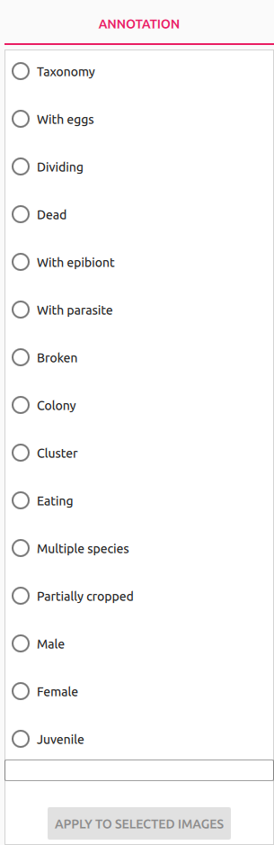
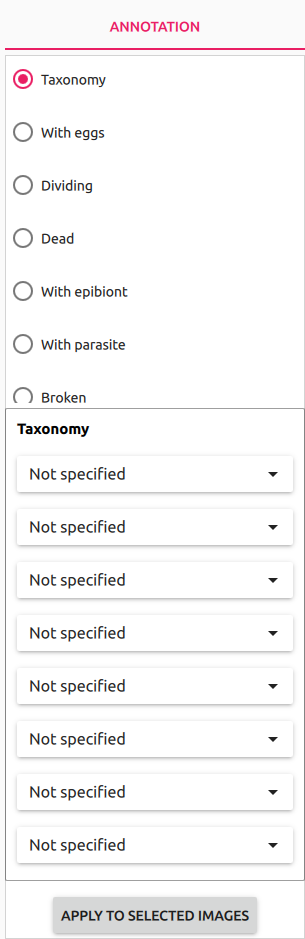
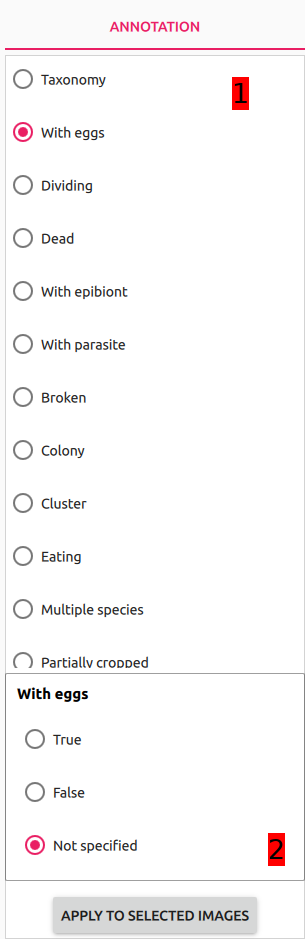

# Annotation pane

Annotation pane is a component where user chooses his or hers current annotation preferences. It's composed of Criterium selection view (1) and Criterium details view (2).

 The Annotation pane can be in one of 3 possible states:

- initial state - no active annotation preferences. There is no criterium chosen in the Criterium selection view (1) and Criterium details view (2) is folded. Choosing `Taxonomy`from (1) changes state to `taxonomic annotation` and choosing any other field changes state to `additional attributes annotation`.

  

- taxonomic annotation - meant for annotating the data with taxonomic values. Behaviour of taxonomy component is analogical to the one from [Filtering pane](../filtering_pane/README.md#Taxonomy).

  

- additional attributes annotation - Annotation pane is in that state when any criterium is selected in (1) but `Taxonomy`. Possible annotation criterium values are `True`, `False` and `Not specified` and are mutally exclusive.

  

Those states cannot be combined, which also effectively means that user is unable to annotate data with a combination of taxonomic values and additional attributes values. It always has to be either of those and for additional attributes it's one attribute at the time.

When user clicks `Apply to selected images` button then all the images selected in the [Image View](../image_view/README.md) with current annotation preference will be annotated appropriately. That action also reloads Image View component.
