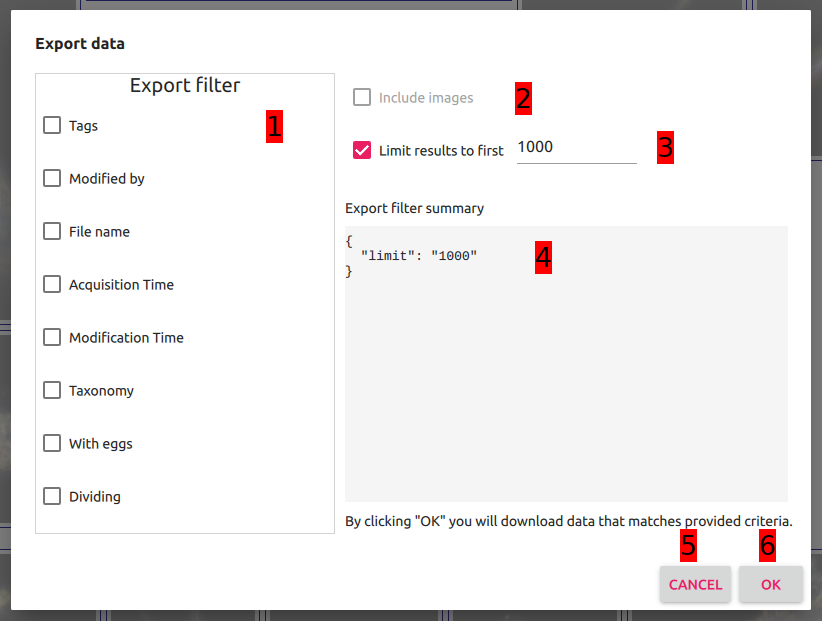

# Data export dialog

This is the data export dialog. It can be opened by clicking `Export` button from the [Main view](../main_view/README.md). Data export dialog serves the feature of exporting the data (annotated or not) out of the system.

  

Data export dialog is composed of a few elements:

1. Export filter - this component allows user to specify what data he or she wants to export form the system. It's behaviour is analogic to [Filtering pane](../filtering_pane/README.md).
2. Include images checkbox - checkbox that specifies whether export data should contain images or not. Currently disabled feature.
3. Limit results field - field that allows limiting the results to first `N` provided in the field.
4. Export summary - user readable summary for chosen export preferences.
5. Cancel button - button that invalidates export operation and leaves the dialog.
6. Ok button - button that confirms chosen export preferences and initializes export operation. For the time of preparing export file the text transitions into running busy indicator. When the export file is ready it's being downloaded via external web browser.

## Export file format
Exported data is single `.tsv` file that contains all the records that match provided export criteria with all the fields that are in the system.
