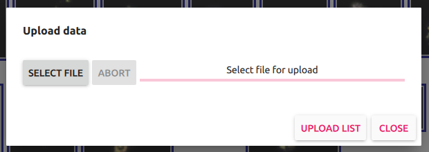
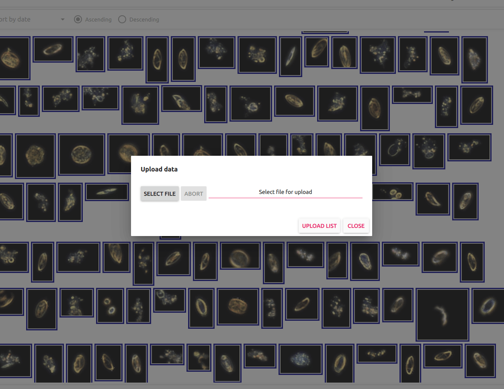
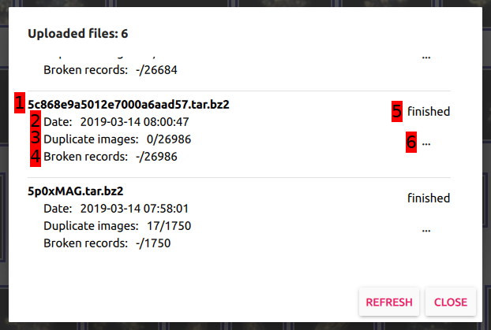
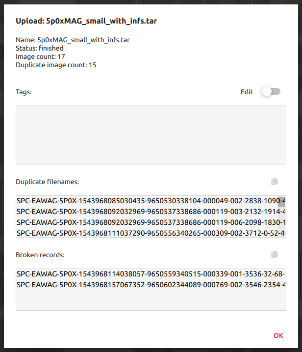
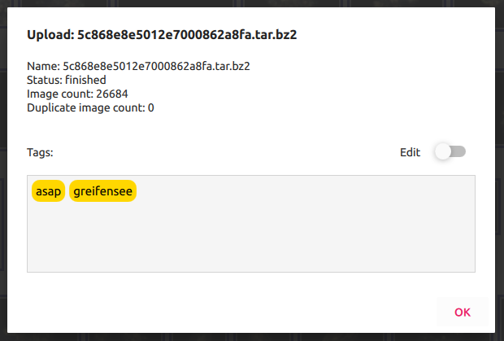
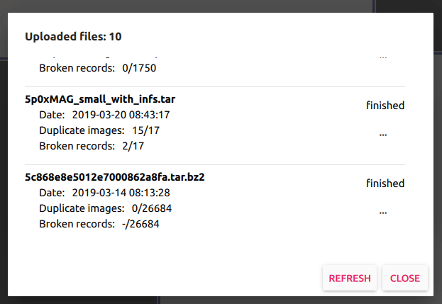

# Data upload dialog

Data upload dialog is a component responsible for all the actions regarding data upload. User can open Data upload dialog by clicking on the `Upload data` button from the [Main view](../main_view/README.md). Actions that can be taken within this dialog are:
 - data upload
 - list data uploads
 - preview data upload details

## Upload dialog

  

This is the initial view of Data upload dialog. Here it is possible to upload new data packages to the system. In order to do so user needs to click on the `Select file` button and choose the data package from their file system. If the package of the same name already exists in the system, the application will prompt adequate message. Nevertheless user can still upload package with duplicated name. If package is uploaded successfully dialog will show status `Upload finished successfully!`. This means that the package was uploaded and is up for further processing that will add package's entries to the system. Upload list and upload details provide better insight in package's state after that point. Upload list state can be activated by clicking on the `Upload list` button.

  

### Allowed upload format
Taxonify supports upload of packages with the following extensions: `.tar.bz2`, `.tar.gz` and `.tar`. There are 2 supported formats of the package's content:
 - native SPC format - directory that contains `features.tsv` file that has `url` field. For every record of that file, the value of `url` field must point to an existing image from within that directory (flat or nested). The rest of the content in that package is ignored.
 - original format - directory that contains `features.tsv` file that has `url` field. For every record of that file, the basename of the value of `url` field must point to an existing image from within that directory (flat). The rest of the content in that package is ignored.

## Upload list

  

User can open this view by clicking on the `Upload list` button in the inital state of Upload dialog. Upload list view presents a list of all uploads along with a brief information about each item. Every upload entry contains:
1. Uploaded package name.
2. Date of upload.
3. Number of duplicate images in given package. Duplicated images are not exactly images duplicated in the scope of this particular upload packages. Images are considered duplicates if they already exist in the system. Two images are considered the same if they have the same filename.
4. Number of broken records in given package. That refers to records from `features.tsv` file that contain `NaN`, `Inf` or blank fields.
5. Upload state. It can be one of:
 - `initialized` - initial state for uploading process. Upload package is in that state until the upload is completed (transition into `uploaded`) or fails (transition into `failed`).
 - `uploaded` - upload package is in that state when uploading is successfully completed. It will transition from that state to `processing` when there are free processing units to handle it.
 - `processing` - in this state the uploaded package is being processed - during this stage images from the package are being added to the system. If the process is successful, upload state transitions into `finished`. If the process fails at any stage, the state transitions to `failed`.
 - `finished` - one of two possible final states for package upload. Package in that stage was added to the system successfully.
 - `failed` - one of two possible final states for package upload. Package in that state is not compliant with supported formats or is broken.
6. Details button. Clicking on that button transfers the user to upload details view.

## Upload details

This is the most detailed upload view available to user. It presents much more details than there were visible in the upload list view. New information here are:
  - [upload tags](#upload-tags)
  - list of duplicate filenames (only visible if there are any). List's content can be copied with copy icon on the right, above the list.
  - list of broken records (only visible if there are any). List's content can be copied with copy icon on the right, above the list.

  

Picture above shows Upload details view with all duplicate filenames and broken records details expanded.

  

Picture above shows Upload details view with all duplicate filenames and broken records details hidden since there are no duplicate filenames and no broken records.

## Upload tags

User can assign tags to upload packages. Those tags are propagated to every image that came to the system from that upload package. User can filter images by tags in [Filtering pane](../filtering_pane/README.md#Tags) or preview them in [Image details pane](../image_details_pane/README.md). There can be more than one tag for one upload package.

### Modifying tags

User can modify upload package's tags simply by enabling the edit mode in the tags widget. To remove a tag from the tags list user has to click on the `x` associated with that tag. In order to add a new tag to the list user has to input the tag name in the `Input tag` field. To save new tags list user needs to click on the `Ok` button.

  

