# Filtering pane

This is the filtering pane. It is used to choose certain data filtering criteria that narrow down presented results.

  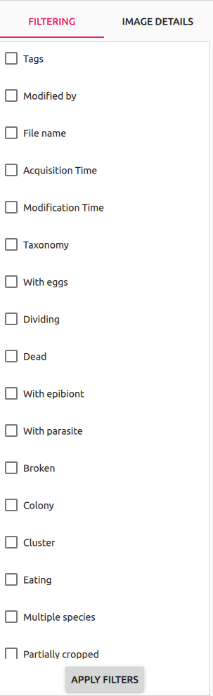

Clicking on the `Apply filters` button sends filtering request to the server and makes [Image View](../image_view/README.md) reload with matching results. After the button is clicked on criteria that were sent to server are bolded (to easily differentiate sent criteria from those chosen afterwards and not applied):

  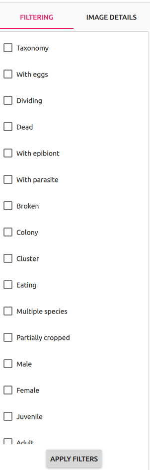

## Filtering criteria overview

### Tags

Tags widget allows to specify tags that items should have assigned in order to match the query.

  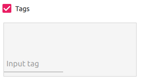

To add a tag user must to input text in `Input tag` field and press enter. There can be multiple tags added to the list.

  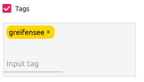

Once a tag is added it is displayed with gold overlay. Clicking on the `x` on the overlay removes the tag from the list.

#### Filtering behaviour
When `Tags` checkbox is not enabled, tags do not take part in data querying.
When user enables tags checkbox tags are part of filtering query. Empty tags field means searching for items that have no tags assigned to. Filled tags field (with one or more tags) means searching for items that have all provided tags on its tags list.

See [Tags](../data_upload_dialog/README.md#Upload-tags) to learn more about tags.

### Modified by

This field allows to query the items by the last user that annotated them.

  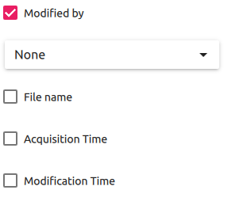

When user clicks on the combo list he or she can choose user from the users list.

  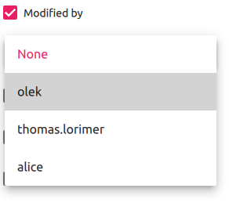

#### Filtering behaviour

When `Modified by` checkbox is not enabled, data is not filtered by that criterion. When the checkbox is enabled filtering by the last user that modified the data behaves differently when it's combined with annotable fields and differently when it's not.

Additionally in the case of querying data by the specific user and specific modification time it is advised to combine this criterion with `Modification time`.

##### Filtering without annotable fields combined
When `Modified by` criterion is not combined with any annotable fields it matches the items where provided user is the last one to modify __any__ annotable field. Please note that such query is more expensive for the system and it might take a bit longer to be processed.

##### Filtering with annotable fields combined
When `Modified by` criterion is combined with some annotable fields it matches the items where provided user is the last one to modify __all__ combined annotable fields.

User value set to `None` matches fields that were not yet modified (all new data added to the system are not modified at the beginning).

### File name

This field allows to query the items by their filenames. User can provide regex that will be matched against the items in the system.

  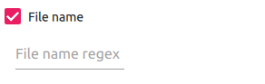

#### Data magnification workaround
Filename querying can be used to query the data by its magnicifation. User can use `SPC-EAWAG-0P5X.*` and `SPC-EAWAG-5P0X.*` regexes to do so.

### Acquisition Time

This component allows user to query the data by acquisition time. Please note that acquisition time refers to external system and it is not the time of adding the data to Taxonify system.

  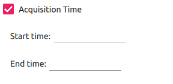

Clicking on the start time or end time field makes date time picker widget appear. User can select date, and time (hours and minutes) with that widget.

  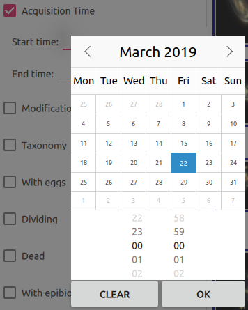

#### Filtering behaviour

Matching items must have acqusition time within provided range. Not specyfing start time removes lower bound requirement. Behaviour is analogical with end time.

### Modification Time

This component alows to query the items by their modification time. Its visual behaviour is the same as for [Acquisition Time](#acquisition-time). Its filtering behaviour hovewer is a combination of [Modified by](#modified-by) and [Acquisition Time](#acquisition-time) logics.

#### Filtering behaviour

When `Modification Time` checkbox is enabled it takes part in filtering logic and behaves differently when combined with annotable fields and differently when not.

Additionally in case of querying data by the specific user and specific modification time it is advised to combine this criterion with `Modified by`.

##### Filtering without annotable fields combined

When `Modification Time` criterion is not combined with annotable fields it matches the items where provided timerange matches modification time of item's __any__  annotable field. Please note that such query is more expensive for the system and it might take a bit longer to be handled.

##### Filtering with annotable fields combined

When `Modification Time` criterion is combined with annotable fields it matches the items where provided timerange matches modification times of __all__ combined annotable fields.

### Taxonomy

Taxonomy component allows to query the data by its taxonomic annotation. It consists of 8 combo boxes that correspond (top to bottom) with taxonomic hierarchy: _empire, kingdom, phylum, class, order, family, genus, species_.

  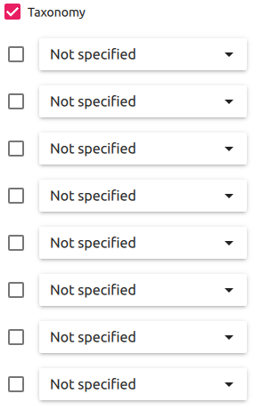

#### Taxonomy bypass

For better user experience this component allows user to choose desired value from any level within the chain with no need to specyfing every step on the way. That action is called Taxonomy bypass and can be peformed at any state of the Taxonomy component. Range of possibilities for given levels is adjusted dynamically.

  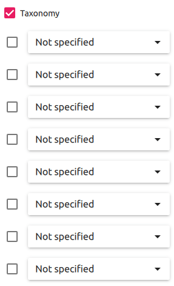

#### Filtering behaviour
Only levels enabled by the checkbox that accompanies them are taking part in filtering logic. Items must be matched by exact value of every checked (enabled) level.

All levels with specific values are automatically enabled. Levels with `Not specified` value are disabled by default but can be enabled manually. Enabling `Not specified` equals requesting only the items for which taxonomy on that level is not yet annotated in the system or that were explicitly set to `Not specified`.

### Additional attributes

Items can be filtered by their additional attributes. Every attribute can have one of three values: _True, False_ or _Not Specified_. Full list of additional attributes can be found [here](../additional_attributes/README.md).

Component that represents a single additional attribute consists of its name and 3 checkboxes (one for every possible value). Multiple checkboxes can be checked at once.

  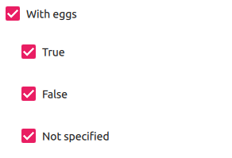

#### Filtering behaviour
Narrows down the search to items having one of selected values for given attribute.
