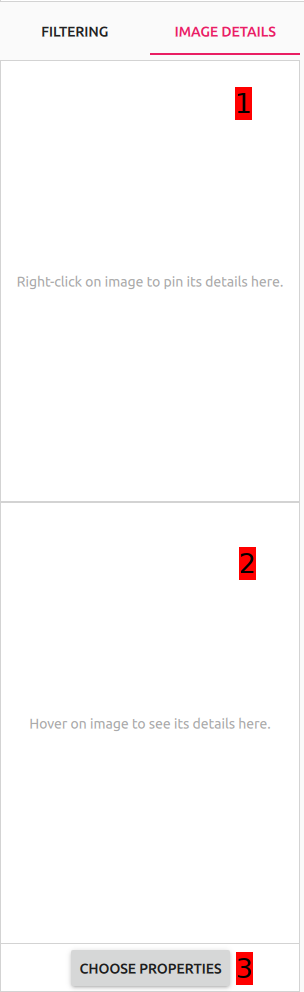
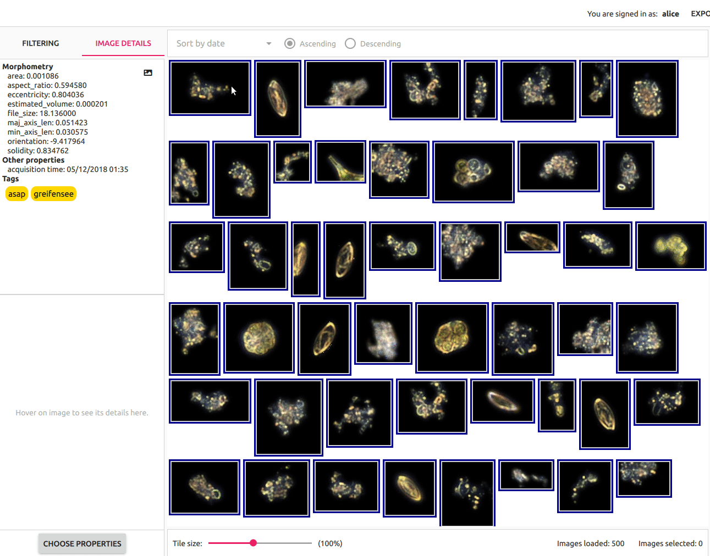
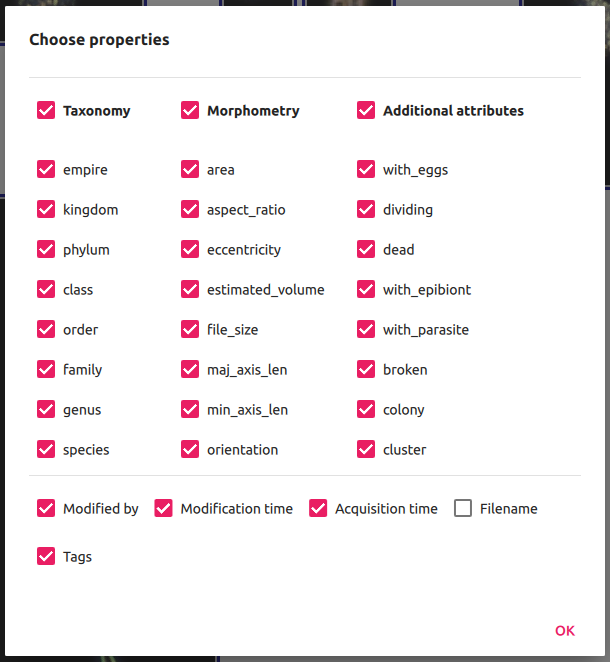
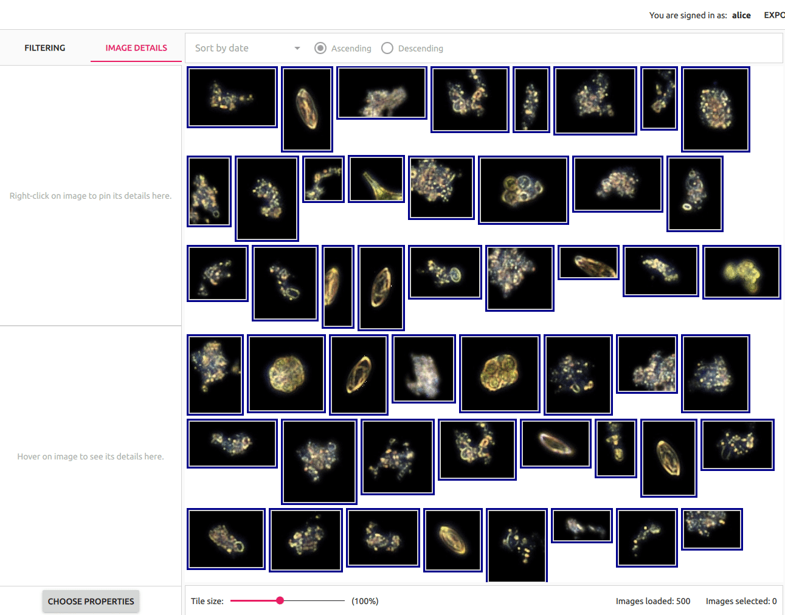

# Image details pane

This is Image details pane. It can be activated by clicking `Image details` tab from the [Main view](../main_view/README.md). User can preview and compare image details with this pane.

The pane itself is composed of 3 components:

1. Right-clicked image details.
2. Hovered image details.
3. `Choose properties` button and properties dialog.

<p align="center">
  
</p>

### Right-clicked image details
Properties of image that was right-clicked on the [Image view](../image_view/README.md#right-click) are displayed here. This view can be scrolled vertically and horizontally if the details info is to big to be displayed at once.

When image is right-clicked (pinned to this view) user can also preview its thumbnail by hovering the mouse cursor over the thumbnail icon in the top right corner of the view.```

<p align="center">
  
</p>

### Hovered image details
Properties of image that was mouse hovered on the [Image view](../image_view/README.md#mouse-hover) are displayed here. This view adapts the scroll positions of [Right-clicked image details](#right-clicked-image-details).

### `Choose properties` button and properties dialog
Clicking `Choose properties` button opens a dialog where user can define which properties should be presented.

<p align="center">
  
</p>

User can select/deselect properties that they want to see in details view by clicking appropriate checkboxes. 3 property groups (`Taxonomy`, `Morphometry` and `Additional attributes`) also have aggregate checkboxes for the whole group. Selecting/deselecting them performs the action for all the properties in the group. User can confirm their choice by clickin `Ok` button, that also closes the dialog.

## Use case example

This use case example shows how user can preview details for right-clicked and hovered images and how they can customize previewed properties.

<p align="center">
  
</p>
