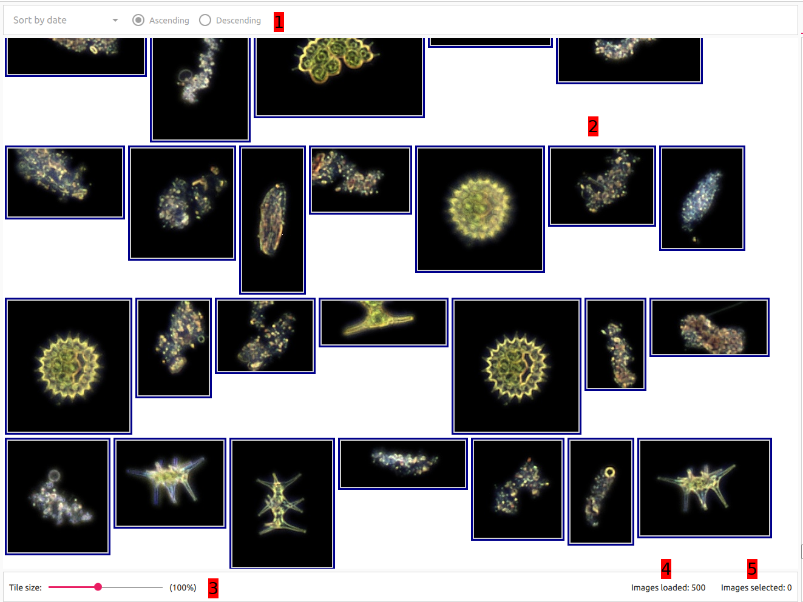

# Image View

## Elements overview
This is the Image View. It displays images that meet current filtering criteria. It's composed of a few elements:

1. Sorting bar. It's meant to provide data sorting utilities. Currently disabled.
2. Image View canvas. All images are displayed on this element.
3. Scale indicator. This slider allows to rescale all images in the view respectively to chosen scale.
4. Number of loaded images indicator. Displays information about how many images are currently loaded in the view.
5. Number of selected images indicator. Displays information about how many images are currently selected for annotation.

  

## User interaction

### Loaded images
Images in this view are loaded in batches of 500. That means that even though there are initially 500 images in the view that meet current filtering criteria there might be more of images like that. When user scrolls the view to the bottom more images are loaded. If user scrolls the view to the bottom and no images were additionally loaded that means there are no more images that meet current filtering criteria. Number of currently loaded images should always be reflected in _Number of loaded images indicator_ from [Elements overview](#elements-overview).

### Interaction with images

#### Left-click
User can click on the image with left mouse button to select it for annotation. Selected image is presented with red border. Left-clicking it again deselects the image. There can be more than one image selected at the time and the number of them should always be reflected in _Number of selected images indicator_ from [Elements overview](#elements-overview).

#### Right-click
User can click on the image with right mouse button to pin it for image details comparison that is available in [Image details pane](../image_details_pane/README.md).

#### Mouse hover
User can hover with mouse cursor over the image to preview its details in [Image details pane](../image_details_pane/README.md).

#### Greyed-out images
Images that are covered with grey overlay (greyed out) indicate that they already meet current annotation preferences.
