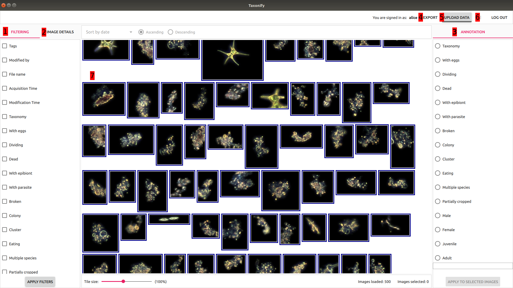

# Main view

This is the main view of Taxonify application. Most of user interaction happens here when he or she can filter, browse and annotate the data.

  

There are 7 important components in that view:

1. [Filtering pane](../filtering_pane/README.md)
2. Image details pane
3. Annotation pane
4. Data export dialog
5. Data upload dialog
6. Settings dialog
7. Image view
