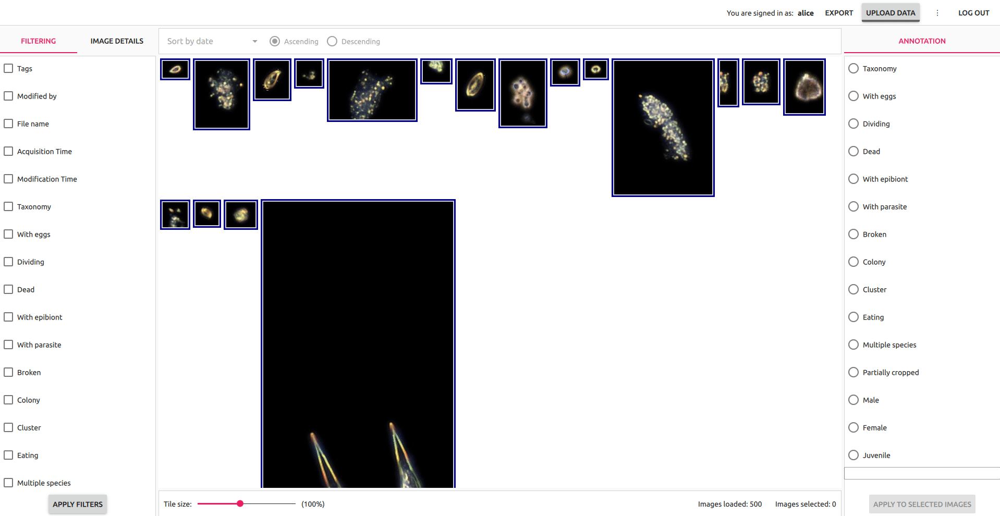

# Main view

This is the main view of Taxonify application. Here users can filter, browse and annotate data and access all other functionalities.

  

There are 7 important components in that view:

1. [Filtering pane](../filtering_pane/README.md)
2. [Image details pane](../image_details_pane/README.md)
3. [Annotation pane](../annotation_pane/README.md)
4. [Data export dialog](../data_export_dialog/README.md)
5. [Data upload dialog](../data_upload_dialog/README.md)
6. [Settings dialog](../settings_dialog/README.md)
7. [Image view](../image_view/README.md)

## Cross-component actions

### Data annotation
Data annotation is a process that involves more than one component of the Main view. In order to annotate data user needs to apply filtering criteria (or no criteria at all), then choose annotation preferences, then select appropriate images and click `Apply to selected images` at the end to finalize annotation.

There are two typical annotation flows:
 - annotation with leaving images in the view
 - annotation with elimination of images

#### Annotation with leaving images in the view
In this variant of annotation flow user sets up data filters in a way that annotation of those images won't exclude them from the filter. Annotated images will stay in the Image view as greyed-out ones.

  

This variant is useful when the ratio of non-annotated images to annotated images is high (there are more images for annotation than anontated ones).

 #### Annotation with elimination of images
 In this variant of annotation flow user sets up data filters in a way that annotation of those images will exclude them from the filter. Annotated images will disappear from the Image view.

  

This variant is useful when the ratio of non-annotated images to annotated images is low (there are less images for annotation than annotated ones).
