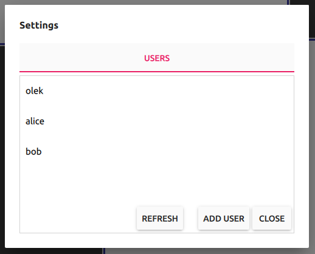
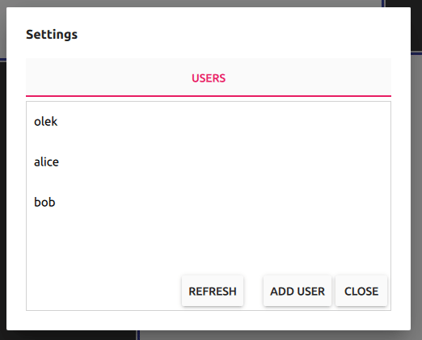

# Settings dialog

Settings dialog is a component responsible for actions with regard to system users management. User can open Settings dialog by pressing `⋮` button from the [Main view](../main_view/README.md).

__Every__ user can add new users here. There's no possibility to remove existing users from the system.

  

This tab is composed of users list and 3 buttons:
- `Refresh` - allows to refresh the users list
- `Add user` - allows to add new users to the system
- `Close` - closes whole Settings dialog.

### Adding new users to the system

Adding new users to the system is possible with simple sequence presented on the animation below:

  

Please notice that during that process user is not asked for password for the new user, because all users share the same password in the system, that is set by the system administrator.

Allowed characters for usernames are alphanumeric characters and dot (`.`). Username must be between 1 and 64 characters long.
